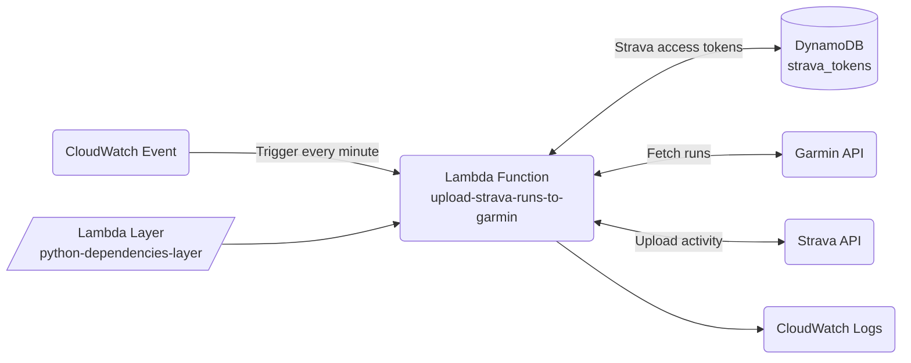
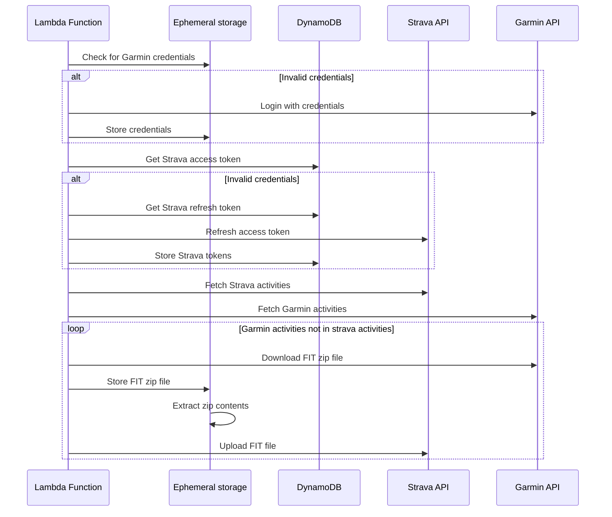

# Upload Garmin runs to Strava Lambda function

## Architecture
Components:
* Lambda Function: performs the business logic
* Lambda Layer: provides the dependencies for the function
* CloudWatch Event: triggers the Lambda Function every minute
* DynamoDB: stores Strava credentials (cheapest option, ideally would use SecretsManager)
* CloudWatch Logs: stores Lambda Function logs
* IAM role/policy: allows the Lambda Function to write to CloudWatch Logs and read/write to DynamoDB



## Business logic
Note: Ephemeral storage is the `/tmp` directory in the Lambda function.



## Tools
* Terraform - [installation](https://developer.hashicorp.com/terraform/tutorials/aws-get-started/install-cli)
* PDM - [installation](https://pdm-project.org/latest/#recommended-installation-method)
* Pre-commit - [installation](https://pre-commit.com/#installation)

## Setup
You will need to set up an API application in Strava settings (see [instructions](https://developers.strava.com/docs/getting-started/#account)). Use `localhost:9321` as your path. Note your Client ID, Client Secret.

Once your API is set up, run
```bash
make get-token
```
and note your Refresh Token to be used for deployment.

You will also need to set up your AWS credentials to be used with Terraform. This can be done with the `aws configure` CLI (see [instructions](https://docs.aws.amazon.com/cli/latest/userguide/cli-chap-configure.html)).

## Deploying
The infrastructure is built and deployed with Terraform. Once you complete the setup, you will need to initialize Terraform. To do so, run
```bash
make tf-init
```

To see the changes that would be made to you account, run
```bash
make tf-plan
```

To publish the changes, run
```bash
make tf-apply
```

## Development
To update code, first create an virtual environmnet with PDM by running
```bash
pdm venv create
```
And start it with
```bash
pdm venv activate
```

Install prod and dev dependencies with
```bash
pdm install
```

Before committing, make sure to run
```bash
pre-commit install
```

## Linting
Formatting and linting use [Ruff](https://docs.astral.sh/ruff). Type checking is done with [MyPy](https://mypy.readthedocs.io/en/stable/).

To format your code (both Terraform and Python), run
```bash
make format
```

To check your Python code with MyPy and Ruff, run
```bash
make check
```
